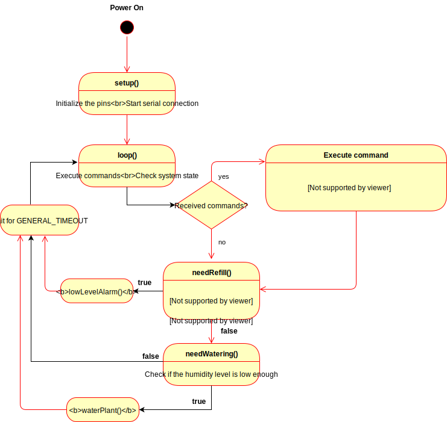

# SmartPot

This project is an automated plant watering system. Depending on the soil humidity, which is periodically checked, the system can pump water into the pot. Another sensors is checking the water level in the reservoir. If it got too low, an alarm will be activated.

Some of the values used in this project were set by trial and error, as this is a project designed for learning.

The main code is inside `SmartPot.ino`. All the functionalities (except sound playing) is implemented in this file. `Music.hpp` is a small "library", which is used to compute the frequency of notes. With some small changes, this can be made to run on PC's, by changing the "output device" of the sounds.

## Circuit schematics & system states

© 2020 Grama Nicolae
